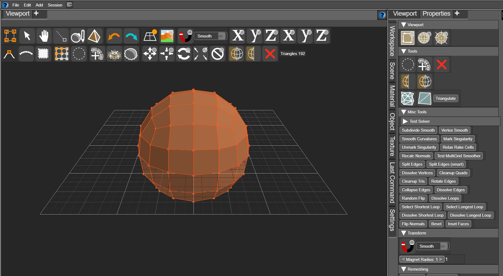

## WebGPU-App-Framework

[Try it out here](https://joeedh.github.io/webgl-app-framework/)

A Blender-inspired 3D content-creation app framework. The realtime renderer is
WebGPU-only; the geometry/sculpting core (`sculptcore`) is a C++20 engine that
compiles to both WebAssembly (browser) and a native N-API addon (the NW.js
desktop shell).

## Prerequisites

- **Node.js** (LTS) and **[pnpm](https://pnpm.io/)** — `npm i -g pnpm`. The repo
  pins a version via `packageManager`; pnpm/corepack will honor it.
- **git** (with submodule support).
- **A C++ toolchain (clang).** Required to build `sculptcore`. The build
  dispatcher (`sculptcore/make.mjs`) installs a pinned **emsdk**, **cmake**, and
  **ninja** for you (`install-emsdk`); you only need a host clang/Visual Studio
  build environment present.
- For the **browser build only** you do *not* need the native addon — just the
  WASM build of sculptcore (see below).

## Checkout

Clone the repo and pull all submodules (`path.ux`, `mathl`, `sculptcore`,
`nstructjs`):

```sh
git clone https://github.com/joeedh/webgl-app-framework.git
cd webgl-app-framework
bash tools/git_pull.sh
```

`tools/git_pull.sh` runs the equivalent of:

```sh
git submodule update --init --recursive
git submodule foreach --recursive git checkout master
git submodule foreach --recursive git pull
```

## Install dependencies

```sh
pnpm i
```

## Building sculptcore

`sculptcore` builds to three targets: **wasm** (browser), **native** (the
standalone executable + C++ tests), and **node** (the NW.js/Node N-API addon).
All builds go through the Node dispatcher `sculptcore/make.mjs` — do not invoke
cmake/emcmake directly.

**One-time setup** (installs the pinned emsdk/cmake/ninja, fetches the
wgpu-native prebuilt, and installs host tools such as `naga`):

```sh
pnpm setup-sculptcore
# equivalent to:
#   cd sculptcore
#   node make.mjs install-emsdk
#   node make.mjs fetch-wgpu-native
#   node make.mjs install-tools
```

**Configure and build everything** (sculptcore wasm + native + node, the sbrush
codegen, then the JS app bundle):

```sh
pnpm configure-all   # configure + sbrush codegen
pnpm build-all       # codegen + build wasm/native/node, then bundle the app
```

Or drive the sculptcore targets individually from the `sculptcore/` directory:

```sh
cd sculptcore
node make.mjs configure [wasm|native|node]  # no arg: configures all three
node make.mjs codegen                       # compile .sbrush kernels
node make.mjs build wasm                     # browser WASM module      -> build/
node make.mjs build native                   # native exe + ctest tests -> build/native/
node make.mjs build node --runtime nw        # NW.js N-API addon        -> build/native-node/
node make.mjs test                           # run the C++ ctest suite
```

Native builds also need prebuilt OpenBLAS + SuiteSparse/CHOLMOD; these are
fetched automatically by `make.mjs deps` (run on demand by `configure native`).
See `sculptcore/Readme.md` for the full build reference.

## Building the app

The JS/TS app bundle is built with ESBuild:

| Command | Action |
| --- | --- |
| `pnpm build` | Build the app bundle (`tools/esbuilder.js`) |
| `pnpm watch` | Rebuild on change |
| `pnpm typecheck` | Regenerate datapaths + run `tsgo --noEmit` |
| `pnpm test` | Run the test suite |

> Note: `pnpm build` only bundles the JS/TS. It expects sculptcore to have been
> built already (at least the **wasm** target for the browser, plus the **node**
> target if you want to run the NW.js desktop shell). Use `pnpm build-all` to do
> both in one step.

## Running

**Browser** — serve `index.html` and open it in a WebGPU-capable browser:

```sh
pnpm serv
```

**Desktop (NW.js)** — launches the native-backed desktop shell (requires the
`node` sculptcore target to be built):

```sh
pnpm nwjs
```
